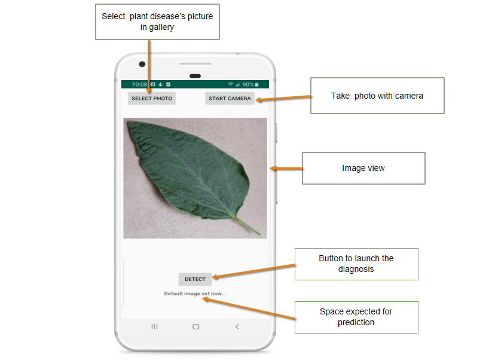

## Plant Diseases Detector
The project is broken down into multiple steps:

* Building and creating a machine learning model using TensorFlow with Keras
* Deploying the model to an Android application using TFLite
* Documenting and open-sourcing the development process
### Blogs
* [Plant Disease Classification with TensorFlow Lite on Android Part 1](https://medium.com/@yannicksergeobam/plant-disease-classification-with-tensorflow-2-0-268fe7f72c2a)
* [Plant Disease Classification with TensorFlow Lite on Android Part 2](https://medium.com/@yannicksergeobam/plant-disease-classification-with-tensorflow-lite-on-android-part-2-c2d47371cea3)

### Screenshots

### App demo
[Green Doctor Demo](https://youtu.be/2UYLglMni6E)
### Libraries

* [Tensorflow 2.0](https://www.tensorflow.org/)
* [TensorFlow Lite ](https://www.tensorflow.org/lite)

### Programming Languages

* Python
* Kotlin

## License

Copyright (c) 2019 Yannick Serge Obam

Licensed under the Apache License, Version 2.0 (the "License");
you may not use this file except in compliance with the License.
You may obtain a copy of the License at

    http://www.apache.org/licenses/LICENSE-2.0

Unless required by applicable law or agreed to in writing, software
distributed under the License is distributed on an "AS IS" BASIS,
WITHOUT WARRANTIES OR CONDITIONS OF ANY KIND, either express or implied.
See the License for the specific language governing permissions and
limitations under the License.

